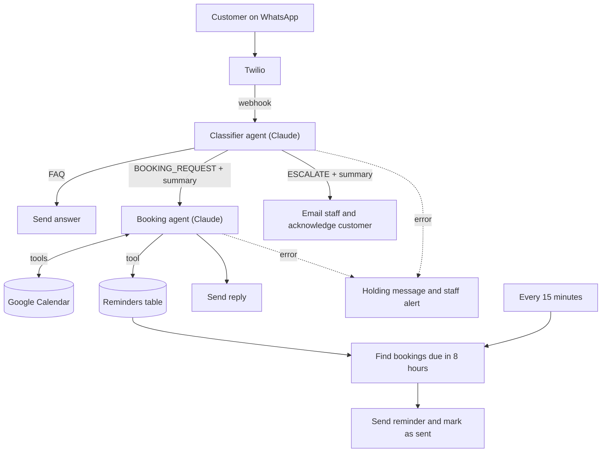

# WhatsApp AI Booking Assistant

An n8n workflow that answers a pub's WhatsApp messages around the clock: it
answers common questions, takes table bookings against Google Calendar, sends
reminders before each booking, and hands anything tricky to staff.

I built it for a pub in Northampton as the first deployment of
[Ayora](https://ayora.org.uk), my AI automation business for UK small
businesses. The workflow here is the production version with client details,
credentials and IDs removed.

## What it does

- **Answers FAQs** (hours, menu, parking) in the tone of a member of staff texting back
- **Takes bookings over several messages**: collects date, time, party size and
  name, checks the calendar, reads the booking back and only books after a clear yes
- **Sends reminders**: a WhatsApp reminder goes out before each booking
- **Escalates** complaints and anything it can't handle confidently: staff get an
  email with an AI summary, and the customer is told someone will follow up
- **Fails safely**: if an AI step errors after retrying, the customer gets a
  holding message and staff get an alert

## How it works



## Design decisions

- **Two agents instead of one.** The classifier only decides what kind of
  message it is and, for bookings, summarises everything agreed so far. The
  booking agent is the only one with calendar tools, so an FAQ can never create
  a booking by accident.
- **Tags for routing.** The classifier starts its reply with `BOOKING_REQUEST` or
  `ESCALATE`; anything else is an FAQ answer sent as it is. A Switch node checks
  for the tag. The smaller bakery bot in this repo takes the other approach:
  strict JSON (`reply`, `escalate`, `reason`) parsed in a Code node, with a safe
  fallback if the model returns something unparseable.
- **Memory per customer.** Both agents keep the last 20 messages, keyed by the
  customer's WhatsApp number, so replies like "yes please" or "make it 7
  instead" are read in context.
- **Dates grounded in UK time.** Today's date (Europe/London) is injected into
  both prompts, and every calendar call uses an explicit UTC offset (+01:00 in
  BST, +00:00 in GMT).
- **Reminders stored as data, not timers.** Each confirmed booking writes a row
  (phone, time, party size, reminder_sent). A schedule runs every 15 minutes,
  sends reminders for bookings in the next 8 hours and marks them sent, so a
  server restart can't lose a reminder.

## What broke and how I fixed it

1. **Webhook kept going dead.** In development, n8n ran in Docker behind ngrok,
   and the tunnel URL changed on every restart, breaking the Twilio webhook. I
   moved n8n to a managed container host (Sliplane) with a fixed URL.
2. **Google OAuth.** Redirect URI mismatches, the Calendar API not being enabled,
   and tokens expiring because the consent screen was still in test mode.
3. **Short replies lost the booking.** A message like "yes" or "7pm" on its own
   was classified as an FAQ. The classifier now checks the conversation history
   and treats short replies as part of the booking in progress.
4. **Bookings at the wrong time.** Times sent without a timezone were read in the
   calendar account's default zone. Every calendar call now includes the UK offset.
5. **Asking for a number it already had.** The agent asked customers for their
   phone number even though WhatsApp provides it. An explicit rule fixed it.
6. **Error messages on every message.** The holding message and staff alert were
   first wired to the agents' normal outputs, so they fired on successful runs
   too. They now sit on n8n's error outputs.

I started on Google Gemini and switched both agents to Claude.

## Tech stack

| Layer | Tool |
|---|---|
| Orchestration | n8n (self-managed, on Sliplane) |
| Messaging | Twilio WhatsApp API |
| AI | Anthropic Claude Sonnet 4.6 through n8n's AI Agent nodes |
| Bookings | Google Calendar API (OAuth 2.0) |
| Staff alerts | Gmail API |
| Storage | n8n Data Tables |

## In this repo

| File | What it is |
|---|---|
| [`workflows/whatsapp-booking-assistant.json`](workflows/whatsapp-booking-assistant.json) | The pub booking assistant described above |
| [`workflows/whatsapp-faq-bot-meta-cloud-api.json`](workflows/whatsapp-faq-bot-meta-cloud-api.json) | A smaller FAQ bot for a bakery, connected directly to Meta's WhatsApp Cloud API (webhook verification, JSON output, staff alerts on WhatsApp) |

## Run it yourself

1. Start n8n, for example locally with Docker:
   ```bash
   docker run -it --rm -p 5678:5678 n8nio/n8n
   ```
2. In n8n, import `workflows/whatsapp-booking-assistant.json`.
3. Create credentials for Twilio, Anthropic, Google Calendar (OAuth2) and Gmail
   (OAuth2), and select them on the matching nodes.
4. Create a Data Table called `booking_reminders` with text columns `phone`,
   `booking_time`, `party_size` and `reminder_sent`, and select it in the three
   table nodes.
5. Replace the placeholders: `[Venue Name]` in the prompts and reminder text,
   `YOUR_CALENDAR_ID`, and `staff@example.com`.
6. In Twilio's WhatsApp sandbox settings, set "When a message comes in" to the
   workflow's production webhook URL (POST), then activate the workflow.

`whatsapp:+14155238886` is Twilio's shared sandbox number. Use your own
WhatsApp sender in production.

## Security and privacy

- This repo contains no credentials, customer data, phone numbers or client
  details. n8n stores credentials separately from workflows.
- **Known gap:** the webhook doesn't check Twilio's `X-Twilio-Signature` header
  yet, so a request to the URL isn't proven to come from Twilio. It's first on
  the roadmap.
- The reminders table holds customer phone numbers and booking times. Rows
  should be deleted once the booking has passed.

## Roadmap

- [ ] Verify Twilio request signatures on the webhook
- [ ] Delete reminder rows after the booking date
- [ ] Move each client onto their own Twilio, Google and Anthropic accounts
- [ ] Missed-call text-back over SMS for trades businesses
- [ ] Replay sample conversations against the classifier as regression tests

## About

Built by Oluwasetemi (Temi) Idowu, Computer Science student at De Montfort
University, Leicester. I use AI tools while building; the design,
debugging and deployment are mine.
